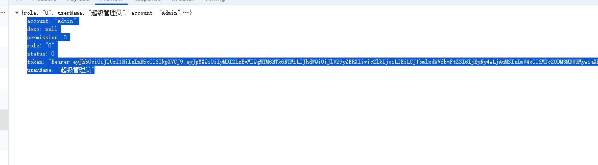

# node版本

- 18.9以上

# npm 版本

- 10.9.3

# pnpm 版本

- 9.15.3

# 运行

- pnpm i
- pnpm run dev

# 打包

- build:dev 测试环境包
- build:pro 线上环境包

# 测试环境账号

- 超管机构： admin /TomTaw@HZ
- 测试机构： admin/TomTaw@HZ1993

【@todo:】1。 datapage 页面的删除放到表格里 2. 表格按钮变文字形式 3. 限制和解除限制颜色变化 4. configuration 请求设备，默认第一条
